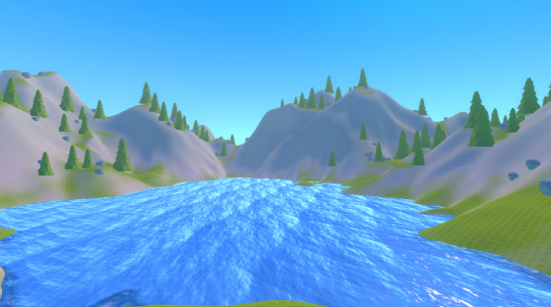
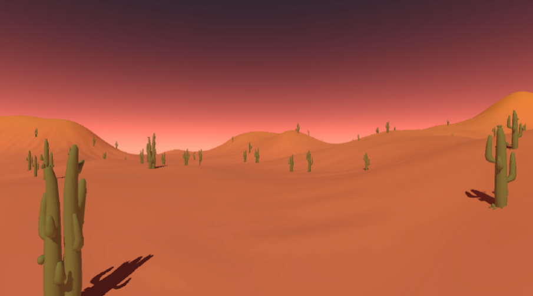
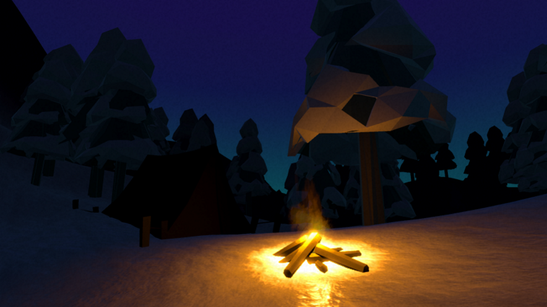

# Procedural Terrain Generator
This is a Procedural Terrain Generator for use in Unity projects. Using random noise algorithms, physics simulation, random object placement, custom materials, textures, and colours an endless variety of worlds can be created using this tool. This tool can create a terrain mesh, water mesh, and randomly place objects among a scene. The following images are scenes created based upon terrains created using this Procedural Terrain Generator.

## Getting Started
### Installing
1. Create a new empty Unity 3D project.
2. Clone into Unity project with `git clone git@github.com:aidan-clyens/TerrainGenerator.git` in the Assets folder.

### Setup Universal Render Pipeline (Optional but required to use sample materials and shaders)
1. Install the Universal Render Pipeline and ShaderGraph to use sample materials and shaders.
2. Create a new Universal Render Pipeline Asset with Depth Texture and Opaque Texture enabled (this is included under the "Settings" folder).
3. Go to Project Settings > Graphics and update the Scriptable Render Pipeline Settings.

### Generating Terrain
1. Add TerrainGenerator prefab into scene.
2. Configure settings and add terrain and water materials.
3. Click "Generate" to create terrain.
4. Randomize terrain settings by clicking "Randomize".
5. Save terrain by entering a name and clicking "Save".
6. Saved terrains can be loading by selecting a name and clicking "Load".

## Terrain Generator

## Height Map Generator

## Hydraulic Erosion

## Forest Generator

## Change Log
### v1.0
- Initial release.

### v1.1
- Fixed sample models imported from Blender.
- Added WaterManager script, which is attached to the Water mesh and used to synchronize waves produced using the sample Water shader. The WaterManager provides the time offset to the Water shader so that the same wave equation may be accessed by script.

## Author
Aidan Clyens
